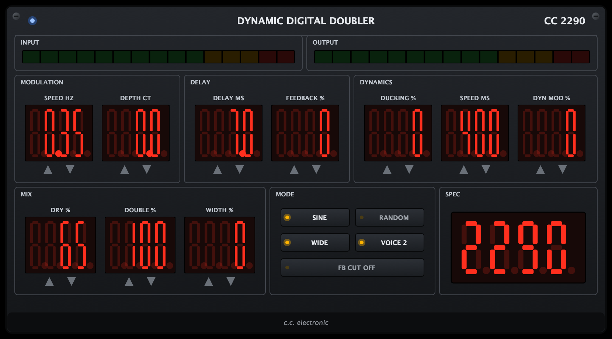

# CC2290 — Dynamic Digital Doubler

> **Learning / demo project.** This is a personal educational project built to learn
> audio DSP and JUCE plugin development. It is **not** a commercial product and is
> **not affiliated with or endorsed by TC Electronic**. "TC2290" is referenced only
> to describe the classic doubling technique that inspired the DSP design; the UI is
> a from-scratch homage to the look of classic rack delays.

A free Audio Unit (AU) doubler plugin for Logic Pro (macOS), modelled after the
classic **TC Electronic TC2290** studio doubling trick:



## How the effect works

The famous "2290 doubling" sound is not a special mode — it is a recipe:

1. **Short delay** (10–50 ms, classic value 24 ms), single tap, no feedback.
   The ear hears this not as an echo but as a second performance.
2. **Delay-time modulation** (sine or random LFO) creates small pitch drift in the
   copy — the secret of a believable double, since no human plays the same take
   twice at identical pitch. The 2290's *automatic depth correction* keeps the
   pitch excursion constant when you change the LFO speed; this plugin does the
   same (depth is set directly in cents).
3. **Dynamics** — the 2290's envelope-driven section: the double ducks under the
   dry signal while you play (ducking), and modulation can deepen the harder you
   play (dynamic modulation).

**The dry signal always stays centred; Width spreads only the wet voices** —
voice A walks right while Voice 2 (the golden-ratio ×1.618 tap) balances it on
the left. Because both wet voices are delayed relative to a centred dry,
neither ear consistently leads and the image never pulls sideways (the
precedence/Haas trap of dry-one-side/wet-other-side splits). This is the same
topology as the well-regarded doublers (MicroShift, Waves Doubler, iZotope).

Two rules of thumb baked into the design:

- **20–80 ms is the doubling zone** (the 2290 manual's own chart): there,
  dry + double on the same channel reads as a second performance. Below
  ~10 ms the same sum combs like a flanger — for short splits use the
  kill-dry recipe below instead.
- **The classic 7 ms split is a 100% wet patch**: set `DRY 0, DOUBLE 100,
  WIDTH 100, DELAY 7` — the left channel gets the 11.3 ms tap, the right the
  7 ms tap, nothing combs and nothing pulls. (Ships as the "Petrucci Split"
  factory preset, after John Petrucci's documented always-on 2290 setting.)

Extras: a **Wide** mode that phase-reverses the wet between left and right
(the hardware's signature "pleasantly broad but not monocompatible" stereo
trick; automatically disabled on mono outputs), a feedback-path hi-cut
(2/4/8 kHz, repeats only, first echo stays full-band — like the hardware's
feedback filters), and an LED rack-style UI with draggable 7-segment displays
and live input/output meters.

True stereo, and **Mono → Stereo**: each input channel gets its own delay
line, so stereo sources keep their image in the doubled signal; on a mono
track in Logic, insert the Mono → Stereo variant to spread a mono source
into a full stereo double. Ducking attenuates both the delay level and the
feedback path, as on the original Dynamic section.

## Factory presets

Real 2290 (the default patch — matched by deconvolving a recording of a real
TC2290: single 7.0 ms tap on both channels, right side phase-reversed, wet
1.37x above the dry, static delay), Vocal ADT, Tight Thickener, Micropitch 231 (an homage to
the Eventide H3000 #231 patch), Big Rhythm Guitars, 2290 Dynamic Double,
Petrucci Split, Slapback 90, Wet Bus 100%, Ultra Wide (Check Mono), and
Axe-FX 2290 Wide (the Fractal "2290 w/ Modulation" tone: 15 ms, one sine LFO
at 0.35 Hz, wet phase-reversed right) — all
reachable from the host's preset/program menu.

## Parameters

| Section | Controls |
|---|---|
| MODULATION | Speed (Hz), Depth (cents) |
| DELAY | Delay (ms), Feedback (%) |
| DYNAMICS | Ducking (%), Dyn Speed (ms), Dyn Mod (%) |
| MIX | Dry (%), Double (%), Width (% wet-voice spread, dry stays centred) |
| MODE | Sine / Random waveform, Wide (wet phase-reverse), Voice 2 (golden-ratio tap), FB hi-cut (2/4/8 kHz/off) |

## Building

Requirements: macOS, Xcode command-line tools, CMake.

```sh
git clone https://github.com/cihancinar77/cc2290-doubler.git
cd cc2290-doubler
git clone --depth 1 --branch 8.0.8 https://github.com/juce-framework/JUCE.git
cmake -B build -DCMAKE_BUILD_TYPE=Release
cmake --build build --config Release -j 8
```

The AU component is installed to `~/Library/Audio/Plug-Ins/Components/` automatically
(`COPY_PLUGIN_AFTER_BUILD`). Verify with:

```sh
auval -v aufx Db90 Cihn
```

A standalone app is also built at `build/CC2290_artefacts/Release/Standalone/CC2290.app`,
and `UISnap` renders the UI to a PNG (used for the screenshot above).

## Status

Built as a learning exercise — expect rough edges. Issues and PRs welcome, but this
is not maintained as a production plugin.
